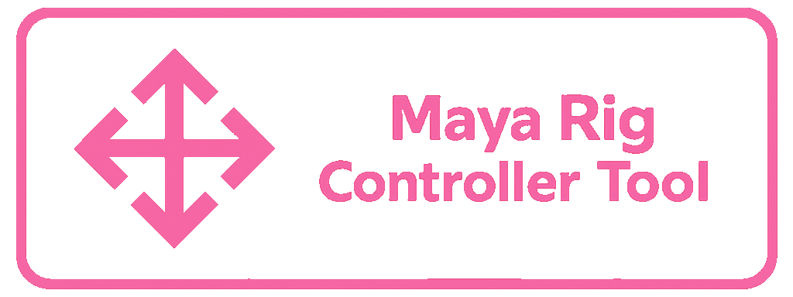

  

<h1 align="center">Maya Rig Controller Tool</h1>

  Tool for Autodesk Maya to create, recolor, manage, and save rig controller shapes.

  

---

## Features

- Create rig controller shapes directly inside Maya
- Use built-in and preinstalled controller shapes included in the tool
- Save and manage custom user shapes
- Recolor controllers with palettes or custom colors
- Create text-based controller shapes
- Adjust shape orientation
- Control line width and shape scale

---

## Installation

1. Download the latest release from the **Releases** page.

2. Extract the downloaded archive.

3. Drag `install_maya_rct.py` into the Maya viewport.

4. Confirm the installation.

5. Launch the tool from the Maya shelf.

---

## Usage

- Open **Maya Rig Controller Tool** from the Maya shelf.
- Use the text controller option to generate text-based shapes if needed.
- Adjust color, orientation, line width, and shape scale if needed.
- Choose and create a  shape.
- Save your own custom shapes for later use.

---

## Screenshots

cooming soon

---

## Preinstalled Shapes

The current preinstalled shape set includes:

- `Circle`
- `Square`
- `Triangle`
- `Cube`
- `Sphere`
- `Pyramid`
- `Arrow`
- `Diamond`
- `Gear`
- `Corner Brackets`
- `Cross Arrow 01`
- `Cross Arrow 02`
- `Cross Arrow Spherical`
- `Cylinder`
- `Soft Cross`
- `Two Way Arc Arrow`

---
## License

This project is licensed under the [GPL-3.0 License](https://www.gnu.org/licenses/gpl-3.0.en.html)